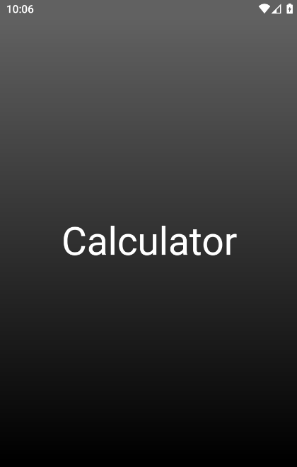
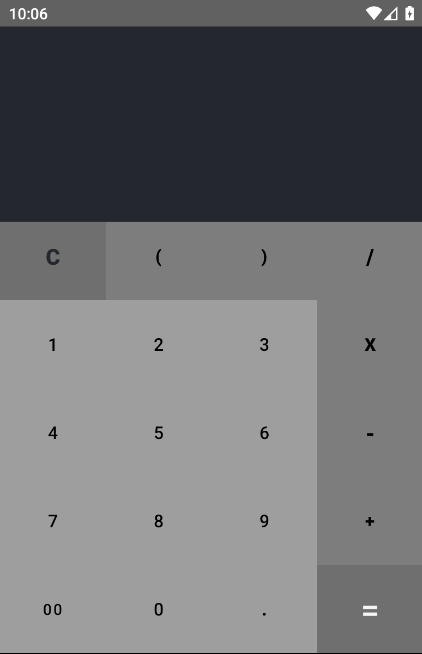
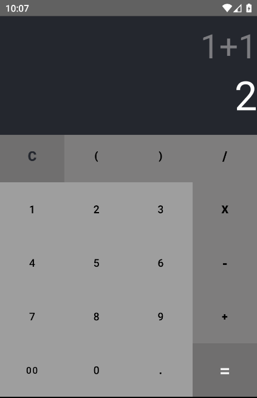

# Calculator
Calculator, aplicação Android, calculadora simples. 

Tecnologias:
<ul>
  <li>Android Studio</li>
  <li>Kotlin</li>
  <li>Exp4j (Biblioteca para avaliação de expressões matemáticas)</li>

</ul>

 

Screenshots:

 

<figure>
	
	<figcaption>Splash Screen </figcaption>
</figure>

 

 

<figure>
	
	<figcaption>Tela principal </figcaption>
</figure>

 

 

<figure>
	
	<figcaption>Tela principal </figcaption>
</figure>
  
