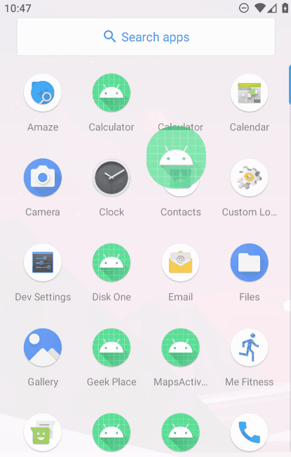

<h1 align="center">Calculator</h1>

<h4 align="center">Aaplicação Android, calculadora simples.</h4>

	
	

Tecnologias:
<ul>
  <li>Android Studio</li>
  <li>Kotlin</li>
  <li>Exp4j (Biblioteca para avaliação de expressões matemáticas)</li>
</ul>

 
